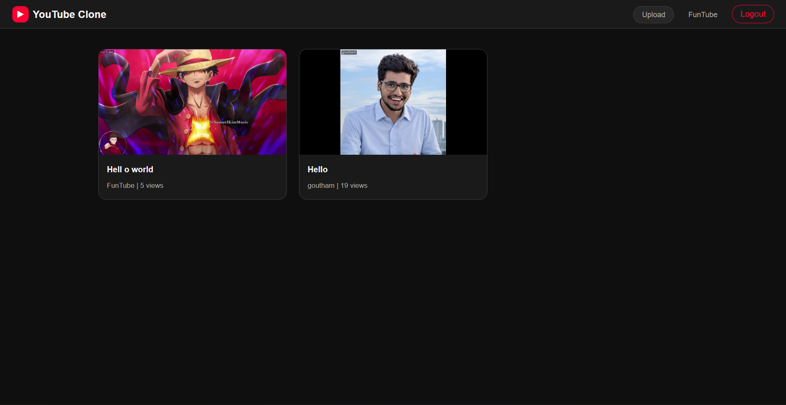
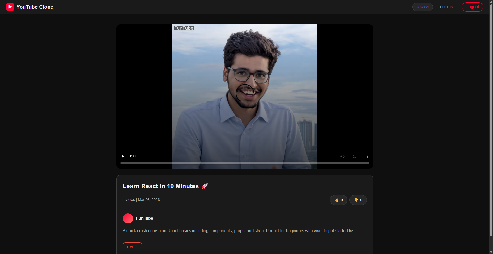
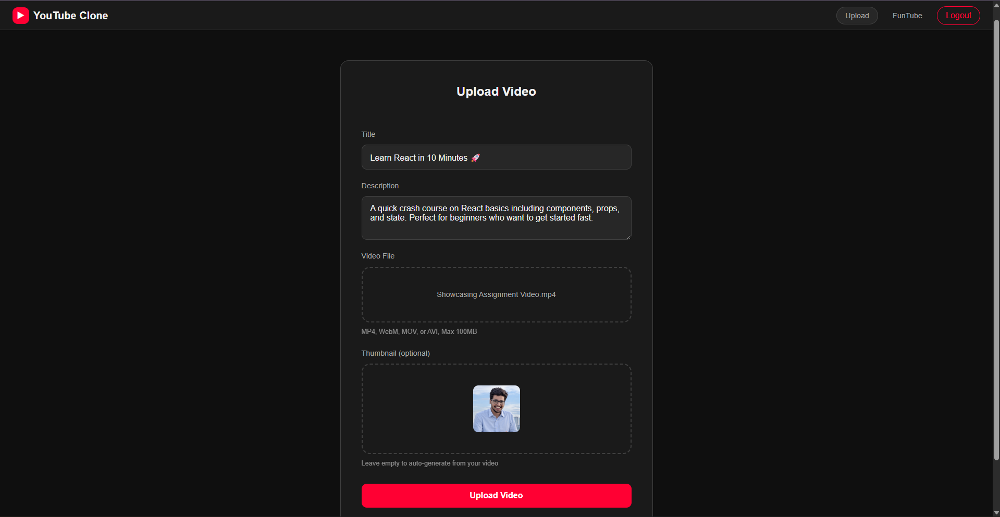
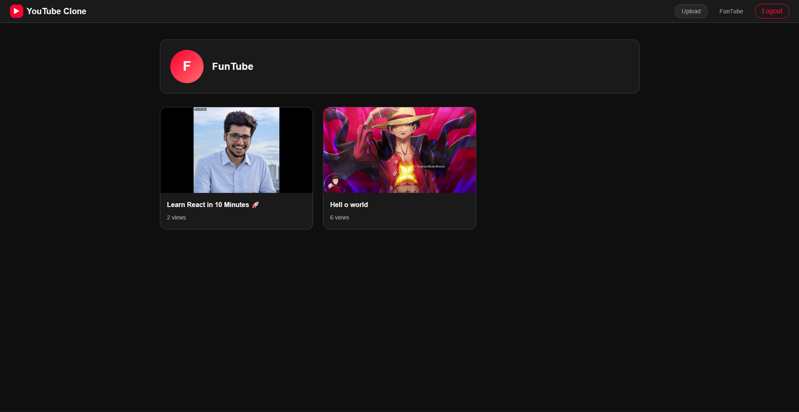

# YouTube Clone

A Django-based YouTube-style video platform where users can register, upload videos, browse channels, watch adaptive streams, and react with likes or dislikes.



This project focuses on the core creator/viewer experience:

- User registration, login, and logout
- Video upload with optional custom thumbnail
- Public home feed and creator channel pages
- Video detail pages with streaming playback
- Like and dislike voting per user
- View counting and owner-only delete actions
- ImageKit-powered media upload, optimization, and thumbnail generation

## Tech Stack

- Python 3.13
- Django 6
- SQLite for local development
- ImageKit for video storage and delivery
- Vanilla HTML, CSS, and JavaScript on the frontend
- `python-dotenv` for environment variable loading

## Features

### Viewer experience

- Browse the latest uploaded videos from the home page
- Open a dedicated video page with title, description, stats, and creator info
- Watch videos through an HLS stream when supported, with an optimized fallback URL
- Like or dislike a video with one vote stored per authenticated user

### Creator experience

- Create an account and sign in
- Upload videos up to 100 MB
- Accept supported formats: MP4, WebM, MOV, and AVI
- Optionally upload a custom thumbnail during video upload
- Get automatically generated thumbnails when a custom one is not provided
- See all uploads on a creator channel page
- Delete your own uploaded videos

### Media handling

- Video files are uploaded to ImageKit
- Thumbnail URLs are generated dynamically
- Thumbnail images include a simple username watermark transformation
- Video playback uses ImageKit transformations for optimization and streaming

## Screenshots

### Home Feed


### Video Player



### Upload Flow



### Channel Page



## Project Structure

```text
YoutubeClone/
|-- pyproject.toml
|-- README.md
|-- docs/
|   `-- screenshots/    # README preview images
|-- youtube/
|   |-- manage.py
|   |-- db.sqlite3
|   |-- youtube/        # project settings, urls, ASGI/WSGI
|   |-- accounts/       # authentication views, forms, urls
|   |-- videos/         # models, upload flow, playback, voting
|   |-- templates/      # shared base template
|   `-- static/         # global CSS and assets
```

## Getting Started

### 1. Clone the repository

```bash
git clone <your-repo-url>
cd YoutubeClone
```

### 2. Create and sync the environment

Using `uv`:

```bash
uv venv
uv sync
```

If you prefer `pip`, install the dependencies listed in `pyproject.toml` manually inside a virtual environment.

### 3. Create a `.env` file

The project loads environment variables automatically with `python-dotenv`.

```env
IMAGEKIT_PUBLIC_KEY=your_imagekit_public_key
IMAGEKIT_PRIVATE_KEY=your_imagekit_private_key
IMAGE_KIT_BASE_URL=https://api.imagekit.io
IMAGEKIT_WEBHOOK_SECRET=optional_webhook_secret
```

Notes:

- `IMAGEKIT_PUBLIC_KEY` is used during upload calls.
- `IMAGEKIT_PRIVATE_KEY` is required by the ImageKit Python SDK.
- `IMAGE_KIT_BASE_URL` is optional if you want to override the SDK default.
- `IMAGEKIT_WEBHOOK_SECRET` is optional in the current app.

### 4. Apply migrations

```bash
uv run python youtube/manage.py migrate
```

### 5. Start the development server

```bash
uv run python youtube/manage.py runserver
```

Open `http://127.0.0.1:8000/` in your browser.

## Main Routes

- `/` - home feed
- `/upload/` - upload page for authenticated users
- `/<video_id>` - video detail page
- `/channel/<username>/` - creator channel page
- `/accounts/register/` - sign up
- `/accounts/login/` - sign in

## Data Model

### `Video`

Stores:

- owner
- title and description
- ImageKit file ID
- video URL and thumbnail URL
- views, likes, dislikes
- created and updated timestamps

### `VideoLike`

Stores one reaction per user per video:

- `1` for like
- `-1` for dislike

The model enforces a unique `(user, video)` pair to prevent duplicate votes.

## Development Notes

- This repository is currently configured for local development.
- The app uses SQLite and `DEBUG = True`.
- Uploaded media is handled by ImageKit instead of local file storage.
- Automated tests have not been implemented yet.

## Commands

```bash
uv run python youtube/manage.py check
uv run python youtube/manage.py test
```

At the moment, Django's system check passes and the test suite contains `0` tests.

## Screenshot Files

The README now uses these files from `docs/screenshots/`:

- `home-feed.png`
- `video-player.png`
- `upload-flow.png`
- `channel-info.png`

## Roadmap Ideas

- Add comments and subscriptions
- Improve search and filtering
- Add playlists and watch history
- Build a richer dashboard for creators
- Add automated tests for upload, voting, and auth flows
- Prepare production settings, media security, and deployment configuration

## Why This Project Stands Out

This is more than a static UI clone. It includes a working backend, authentication flow, database models, upload pipeline, adaptive streaming integration, and creator-specific actions. It is a strong foundation for turning a simple clone into a real video platform project.
